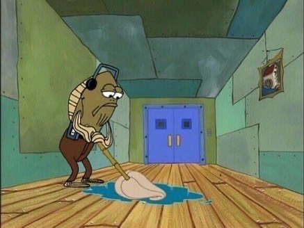

<h1 align="center">Hi 👋, I'm Erwan SINCK</h1>
<h3 align="center">A passionate DevOps from France</h3>
<h4 align="center">https://erwansinck.com</h4>

  

- 🔭 I’m currently working with [Uncove](https://Uncove.com/)

- 📫 How to reach me **erwan.sinck@ynov.com**

<h3 align="left">Connect with me:</h3>

 

